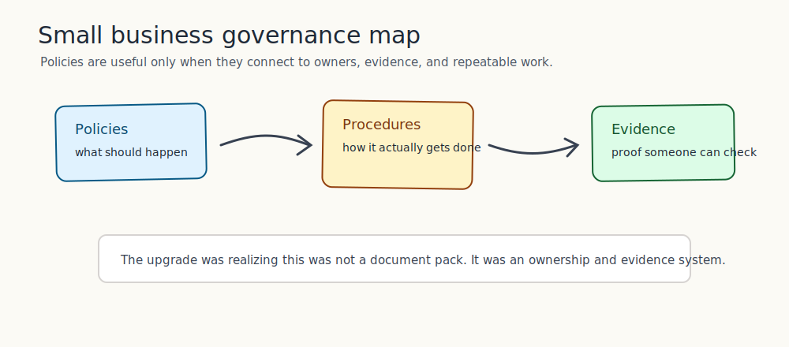
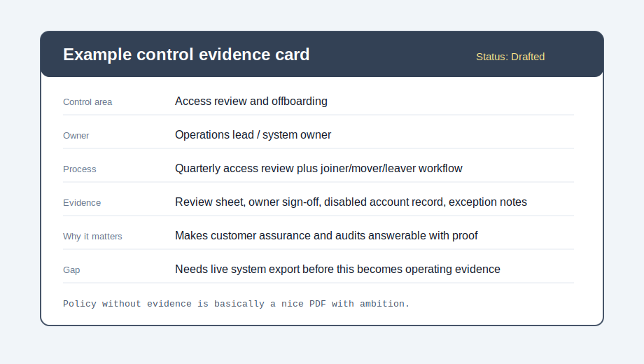
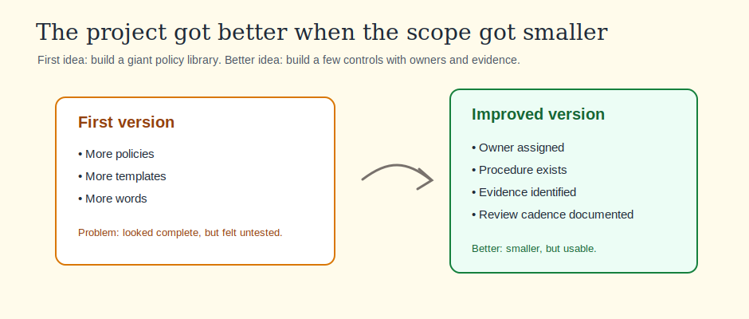
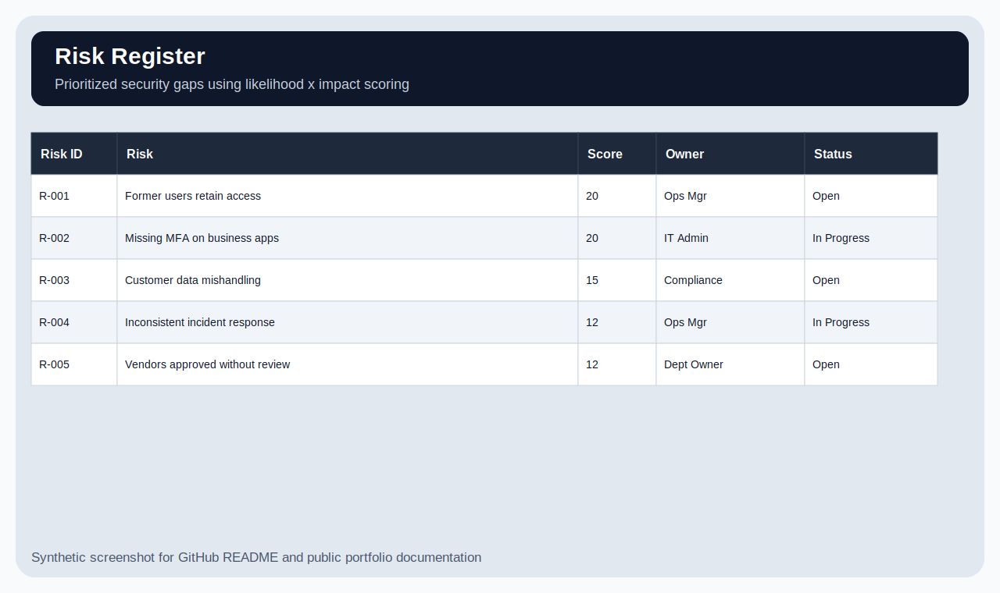
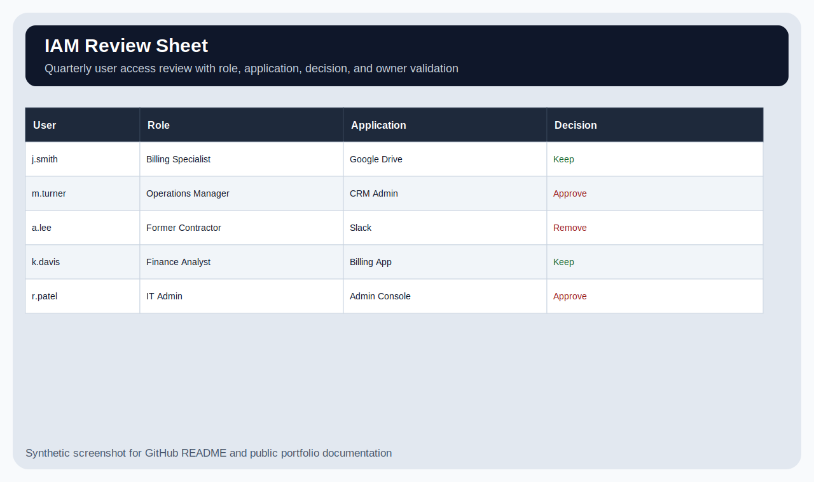
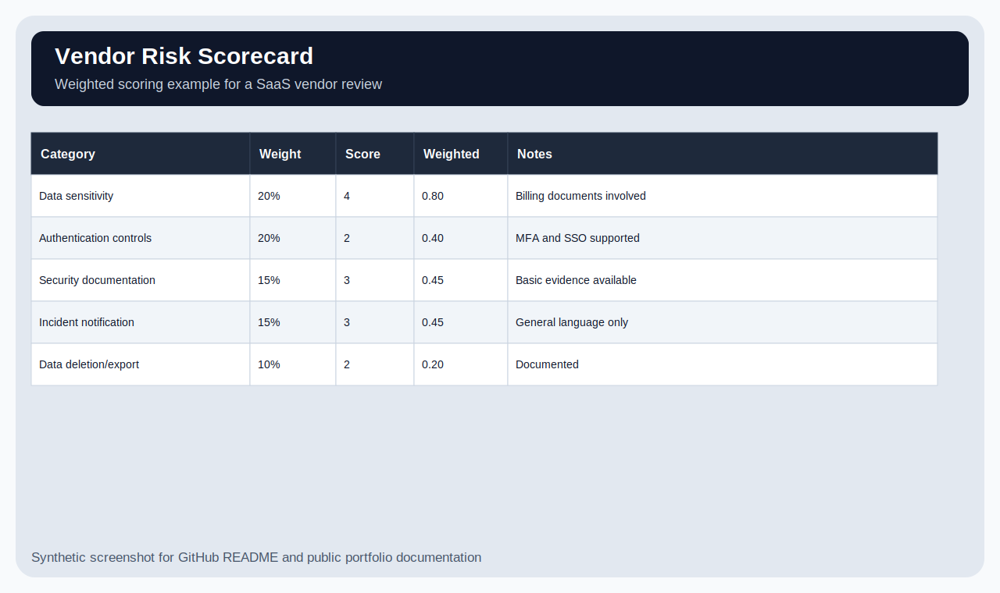

<div align="center">

# Small Business Security Governance Program

**A lightweight security governance project for a fictional small business**  
Policies + procedures + IAM governance + vendor review + practical security documentation

   

</div>

---

## What this project demonstrates



This is a lightweight security governance program for a simulated 25-person professional services company.

The goal was to build something a small business could actually use: a basic policy structure, IAM governance, vendor review, questionnaire support, and a few technical validation checks. I kept the scope modest because a company this size would not have a mature enterprise security program on day one.

All data, users, systems, and vendors are synthetic.

---

## Skills used

| Skill | How it shows up here |
|---|---|
| Security governance | Built a small program with owners, processes, and review expectations. |
| Policy writing | Created practical policies instead of oversized enterprise-style documents. |
| Procedure design | Connected policy expectations to repeatable steps. |
| IAM governance | Included joiner, mover, leaver and access review practices. |
| Vendor review | Used a scoring approach instead of informal yes/no review. |
| Questionnaire support | Connected common security answers back to supporting artifacts. |
| Technical validation | Connected governance work to SaaS admin checks. |
| Security communication | Wrote materials a non-technical business owner could understand. |

**Estimated time to build/recreate:** ~10–14 hours across multiple working sessions.  
The main lesson: more policies do not automatically mean more security. Sometimes it just means more PDFs looking busy.

---

## Quick visual tour

| Governance map | Control card |
|---|---|
|  |  |

| Scope iteration | Risk register |
|---|---|
|  |  |

| IAM review sheet | Vendor scorecard |
|---|---|
|  |  |

---

## What I was trying to solve

The company had several common small-business security gaps:

- Access was granted informally.
- Offboarding depended on people remembering the right steps.
- Vendor reviews were inconsistent.
- Security questions were difficult to answer with supporting artifacts.
- Policies existed as ideas, but not as a repeatable program.

At first this looked like a documentation problem. After mapping the work, it became more of an ownership problem: who owns each control, what process supports it, and what artifact would exist if someone asked?

---

## Main artifacts

| Area | Location |
|---|---|
| IAM governance | `iam-governance/` |
| Program traceability | `program/security-program-traceability-matrix.md` |
| Risk register | `evidence/risk-register.md` |
| Vendor scoring | `evidence/vendor-risk-scoring.md` |
| Questionnaire support | `customer-assurance/questionnaire-response-pack.md` |
| Technical validation | `technical-validation/google-workspace-security-audit.md` |
| Policies and procedures | `policies/`, `procedures/` |
| Analyst journal | `docs/analyst-journal.md` |

---

## One example control card

| Field | Detail |
|---|---|
| Control area | Access review and offboarding |
| Owner | Operations lead / system owner |
| Process | Quarterly access review plus joiner, mover, leaver workflow |
| Supporting artifacts | Review sheet, owner sign-off, disabled account record, and exception notes |
| Why it matters | Makes governance answerable with real documentation instead of promises |
| Current gap | Needs a live system export before this becomes operating proof |
| Next step | Run a sample review cycle and store the result |

This is the kind of governance detail I wanted the project to show. The policy says what should happen. The procedure says how. The supporting artifact shows whether it happened.

---

## Project structure

```text
Security-Policy-Procedure-Pack/
├── customer-assurance/           # Questionnaire response support
├── docs/                         # Analyst journal and portfolio visuals
│   └── images/                   # README visuals
├── evidence/                     # Risk register and vendor scoring
├── iam-governance/               # IAM governance artifacts
├── policies/                     # Policy documents
├── procedures/                   # Procedure documents
├── program/                      # Program traceability matrix
├── screenshots/                  # Original SVG screenshots from the lab
├── technical-validation/         # Simulated SaaS security audit checklist
└── README.md
```

---

## What I got wrong first

My first instinct was to make the project bigger by adding more documents. That would have looked impressive at a glance, but it would not necessarily make the program better.

I revised the approach around ownership and supporting artifacts. For each major area, I wanted to answer: who owns it, what process supports it, what artifact would exist, and how often should it be reviewed?

More notes are in `docs/analyst-journal.md`.

---

## What I could confirm

- The program has clear owners for major security tasks.
- IAM has a defined joiner/mover/leaver process.
- Vendor review has a scoring method instead of an informal yes/no decision.
- Questionnaire answers point back to supporting files.
- The technical validation checklist connects governance to SaaS admin checks.

## What I could not confirm

- These controls are not operating in a live environment.
- No real users or vendors were reviewed.
- The SaaS audit is a simulated checklist, not a production export.
- This does not prove formal certification or certification readiness.

---

## Lessons learned

The biggest lesson was that policies alone do not make a security program. A policy needs an owner, a process, supporting artifacts, and a review schedule. Otherwise it is just a document.

I also learned that IAM is probably the strongest bridge between SaaS implementation work and cybersecurity. User onboarding, permissions, admin access, questionnaire support, and process documentation all show up in real IAM and GRC work.

---

## What I would improve next since Rome did not finish its risk register in one afternoon

1. Add a mock quarterly access review package with sign-off.
2. Add a simple vendor intake form and scored example.
3. Add a one-page security overview for a business owner.
4. Add screenshots from a real lab SaaS tenant.
5. Create a short executive summary.

---

## Important note

This is a defensive governance portfolio lab using fictional company data. It is meant to show security documentation, ownership, and practical governance thinking, not to claim formal certification experience.
