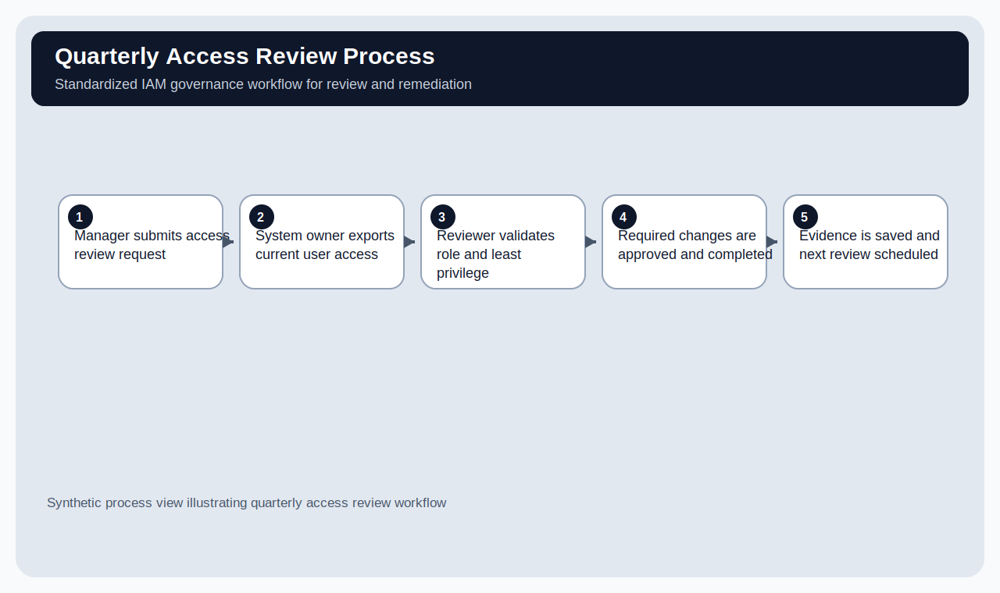
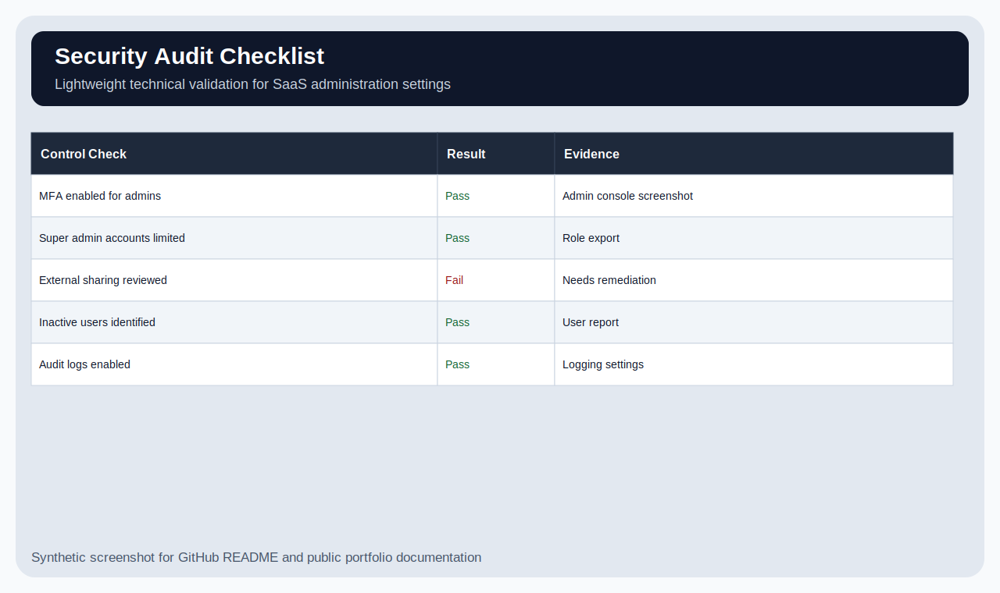

# Small Business Security Governance Program

## Overview

This is a lightweight security governance program for a simulated 25-person professional services company, **Northstar Dental Billing LLC**.

The goal was to build something a small business could actually use: basic policy structure, IAM governance, vendor review, customer security questionnaire support, and a few technical validation checks. I kept the scope intentionally modest because a company this size would not have a mature enterprise GRC program on day one.

All data, users, systems, and vendors are synthetic.

---

## What I was trying to solve

The company had several common small-business security gaps:

- Access was granted informally.
- Offboarding depended on people remembering the right steps.
- Vendor reviews were inconsistent.
- Customer security questions were difficult to answer with evidence.
- Policies existed as ideas, but not as a repeatable program.

At first this looked like a documentation problem. After mapping the work, it became more of an ownership and evidence problem: who owns each control, what process supports it, and what proof would exist if a customer or auditor asked?

---

## Main artifacts

| Area | Evidence |
|---|---|
| IAM governance | `iam-governance/` |
| Program traceability | `program/security-program-traceability-matrix.md` |
| Risk register | `evidence/risk-register.md` |
| Vendor risk scoring | `evidence/vendor-risk-scoring.md` |
| Customer questionnaire support | `customer-assurance/questionnaire-response-pack.md` |
| Technical validation | `technical-validation/google-workspace-security-audit.md` |
| Policies and procedures | `policies/`, `procedures/` |

---

## Screenshots

### Risk Register

### IAM Review Sheet

### Vendor Scorecard

### Access Review Process

### Technical Audit Checklist

---

## What I could confirm

- The program has clear owners for major security tasks.
- IAM has a defined joiner/mover/leaver process.
- Vendor review has a scoring method instead of an informal yes/no decision.
- Customer questionnaire answers point back to evidence files.
- The technical validation checklist connects governance to actual SaaS admin checks.

## What I could not confirm

- These controls are not operating in a live environment.
- No real users, vendors, or customer contracts were reviewed.
- The Google Workspace audit is a simulated validation checklist, not a production export.
- This does not prove compliance with NIST, CIS, SOC 2, HIPAA, or any formal framework.

---

## Lessons learned

The biggest lesson was that policies alone do not make a security program. A policy needs an owner, a process, evidence, and a review schedule. Otherwise it is just a document.

I also learned that IAM is probably the strongest bridge between SaaS implementation work and cybersecurity. User onboarding, permissions, admin access, customer assurance, and process documentation all show up in real IAM and GRC work.
