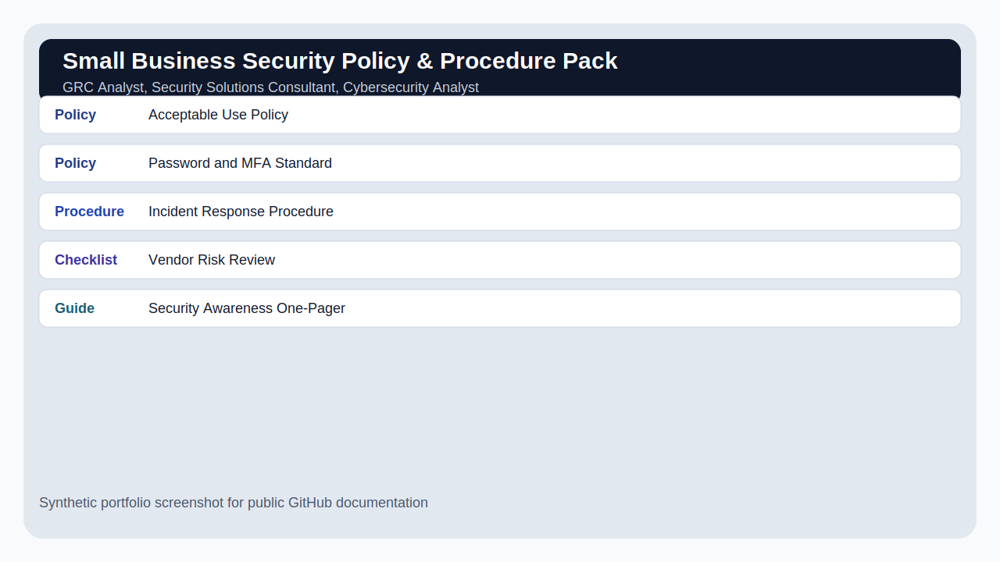

# Small Business Security Policy & Procedure Pack

## Overview

A practical GRC documentation pack containing security policies, incident response procedures, access control rules, vendor review guidance, and employee awareness material.

## Scenario

A small business needs baseline cybersecurity documentation to support safer operations, customer trust, and future compliance readiness.

## Target Roles

GRC Analyst, Security Solutions Consultant, Cybersecurity Analyst

## Tools and Concepts Used

Policy writing, NIST CSF-style control thinking, incident response procedure design, security awareness documentation

## Key Findings

| Severity / Type | Finding | Why It Matters |
|---|---|---|
| Policy | Acceptable Use Policy | Defines safe use of company systems and data. |
| Policy | Password and MFA Standard | Sets minimum authentication expectations. |
| Procedure | Incident Response Procedure | Creates a repeatable process for triage, containment, eradication, and recovery. |
| Checklist | Vendor Risk Review | Helps assess third-party access and data handling risk. |
| Guide | Security Awareness One-Pager | Turns security expectations into employee-friendly language. |

## What I Did

1. Defined the scope and business scenario.
2. Reviewed synthetic evidence/data.
3. Identified security issues and mapped them to business risk.
4. Prioritized findings by severity and likelihood.
5. Wrote remediation or improvement recommendations.
6. Documented the project in a way a recruiter, hiring manager, or technical reviewer can follow.

## Screenshots

## Interview Explanation

This project shows my documentation strength. Security work only creates value when people can understand and follow it, and this pack demonstrates that I can turn controls into usable guidance.

## How to Confidently Explain This Project

Use this structure:

1. **Situation:** Explain the business problem.
2. **Task:** Explain what security question you were trying to answer.
3. **Action:** Explain your investigation or review steps.
4. **Result:** Explain what you found and what you recommended.

Example:

> I created this project to practice the workflow used by security teams: define scope, collect evidence, identify risk, prioritize what matters, and communicate next steps. I used synthetic data so the project is safe to publish, but the process mirrors how entry-level analysts contribute in real environments.

## Beginner Mistakes This Project Avoids

- Listing tools without explaining the security outcome.
- Treating every alert or finding as equally important.
- Forgetting to explain business impact.
- Publishing real logs, IP addresses, client data, or secrets.
- Writing notes that only the author can understand.

## Files Included

- `README.md` - Project overview and explanation.
- `data/sample-data.csv` - Synthetic evidence used for the project.
- `reports/final-report.md` - Polished report-style writeup.
- `screenshots/project-summary.svg` - Public-safe screenshot mockup.
